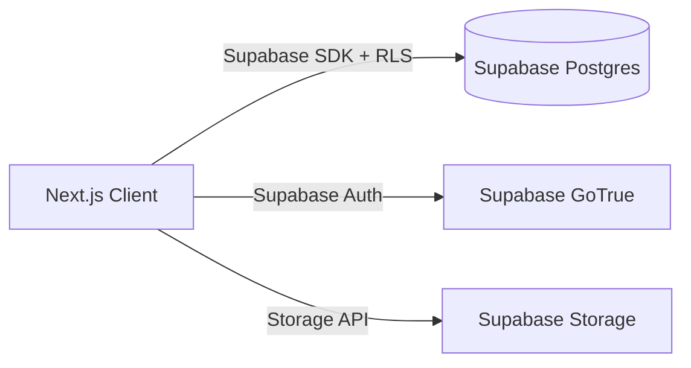
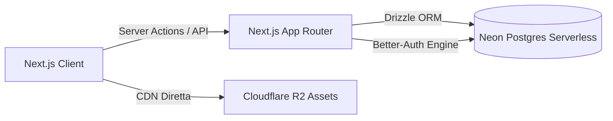

# Analisi Comparativa Stack Backend: Supabase vs Neon + Better-Auth + Drizzle

Documento di riferimento per la futura valutazione architetturale del backend (Fase 0.9.0+ / #14, #15, #16, #28).  
*Non sostituisce [transizione-next-supabase.md](transizione-next-supabase.md), ma ne approfondisce e confronta l'alternativa serverless modulare.*

---

## 🎯 1. Il Contesto e la Motivazione

L'attuale applicazione ARC Benches è una Client SPA (Vite + React + localStorage). Per la versione 1.0.0 è pianificato il passaggio a un'architettura **Next.js App Router** con autenticazione, persistenza multi-dispositivo e gestione centralizzata dei dati di gioco (inclusa la finestra di spedizione globale).

Durante la valutazione di **Supabase (BaaS All-in-One)** è emersa una criticità operativa:
- **Pausa per Inattività nel Free Tier**: Supabase mette in pausa ("paused project") i database gratuiti dopo **7 giorni consecutivi di inattività API**.
- **Stagionalità dell'App**: Un companion tracker per un gioco con wipe/stagioni o periodi di fermo rischia di trovarsi con il database congelato, costringendo lo sviluppatore a un login manuale sulla dashboard per sbloccarlo.

Questo documento mette a confronto **Strategia A (Supabase)** e **Strategia B (Modular Serverless: Neon + Better-Auth + Drizzle)**.

---

## ⚖️ 2. Confronto Architetturale Diretto

| Dimensione | Strategia A: Supabase All-in-One | Strategia B: Neon + Better-Auth + Drizzle (Modulare) |
| :--- | :--- | :--- |
| **Paradigma** | BaaS (Backend as a Service integrato) | Architettura Serverless Modulare composita |
| **Database** | Postgres managed con estensioni e RLS | Serverless Postgres (Compute separato dallo Storage) |
| **Comportamento Inattività** | ⏸️ **Pausa forzata dopo 7 giorni**. Richiede sblocco manuale da UI. | 🟢 **Zero pause bloccanti**. Scala a 0 CPU quando inattivo; si risveglia in automatico alla prima query (~500ms cold start). |
| **Costo Free Tier** | 0 €/mese (2 progetti, 500 MB DB) | 0 €/mese (0.5 GiB DB, 100h compute attiva/mese) |
| **Autenticazione** | Supabase Auth (GoTrue integrato) con Row Level Security a livello DB | **Better-Auth** (open-source in Next.js Server Actions) salvato su Postgres |
| **ORM / Querying** | Client Supabase SDK (`supabase.from('...')`) + SQL Postgres | **Drizzle ORM** (TypeScript puro, 100% type-safe, migrazioni automatiche) |
| **Asset / File Storage** | Supabase Storage (S3-compatible integrato) | **Cloudflare R2** (10 GB gratis, 0 € costi di banda/egress) |
| **Admin & Studio** | Dashboard web completa fornita da Supabase | Drizzle Studio locale (`npx drizzle-kit studio`) + Area `/admin` first-party Next.js |
| **Lock-in** | Medio (legato alle API e all'ecosistema Supabase) | **Minimo (Zero Lock-in)**: Postgres puro, codice TypeScript proprietario |

---

## 🧩 3. Integrazione con la Codebase Esistente

Entrambe le strategie riutilizzano integralmente il **Domain Core** già validato in questo repository:

```
src/ (Repository Attuale)                  Nuovo Repo Next.js (v0.9.0)
──────────────────────────────────────────────────────────────────────────
lib/selectors.ts, craft.ts         ───►   lib/core/ (100% riuso logica pura)
lib/validate.ts (Zod schemas)      ───►   lib/schema/ (validazione API & DB)
data/items-overrides.json          ───►   Database seed & /admin overrides
scripts/ (fetch-items, normalizer) ───►   scripts/ (pipeline caricamento DB)
docs/specs/ & docs/adrs/           ───►   docs/ (specifiche di business)
Zustand Store (slices)             ───►   Client cache reattiva + Sync hook
```

### Come cambia il flusso dati:

#### Con Strategia A (Supabase):


#### Con Strategia B (Neon + Better-Auth + Drizzle):


---

## 🔍 4. Valutazione dei Trade-off

### Vantaggi Strategia A (Supabase):
1. **Meno codice infrastrutturale da scrivere**: Auth, RLS, Storage e Realtime sono già pronti.
2. **Dashboard Web Out-of-the-Box**: Visualizzazione e modifica tabelle direttamente dal portale web di Supabase.

### Svantaggi Strategia A (Supabase):
1. **Rischio di disattivazione/pausa progetto per inattività nel free tier**.
2. **RLS a livello di DB**: Debuggare e testare le policy Postgres RLS può essere più complesso rispetto a controlli applicativi TypeScript.

---

### Vantaggi Strategia B (Neon + Better-Auth + Drizzle):
1. **Resilienza assoluta alle pause**: Nessuna scadenza a 7 giorni, nessun bisogno di cron di keep-alive artigianali.
2. **Full TypeScript & Developer Experience**: Schema DB, migrazioni e query 100% type-safe tramite Drizzle ORM.
3. **Costi e scalabilità a lungo termine**: Zero costi di banda su Cloudflare R2 per le mappe pesanti; utenti illimitati su Better-Auth.
4. **Indipendenza totale**: Il backend vive interamente nel codice del repository Next.js.

### Svantaggi Strategia B (Neon + Better-Auth + Drizzle):
1. **Setup iniziale dell'Auth**: Richiede configurare Better-Auth con il client Discord/OAuth e le tabelle di sessione in Drizzle (lavoro una tantum di poche ore).
2. **Gestione Admin UI**: Necessita di Drizzle Studio o di una semplice pagina `/admin` protetta in Next.js.

---

## 📋 5. Mandato e Piano di Decisione Futura (Verso v0.9.0)

Quando la roadmap raggiungerà la **Versione 0.9.0**, la scelta definitiva sarà guidata dai seguenti step strutturati:

1. **Step 1 — Verifica Requisiti Realtime & Volume Dati**:
   - Se le mappe interattive (Issue #61) richiedono centinaia di megabyte di tile, confermare **Cloudflare R2**.
   - Se il realtime live è limitato alla sola finestra di spedizione (aggiornata ogni X giorni/ore), il polling o Server Actions con caching bastano senza connessioni websocket permanenti.
2. **Step 2 — Spike Prototipale Tecnico (Issue #14 / #15)**:
   - Prova di deploy con Neon + Drizzle + Better-Auth su un branch / repo sandbox.
   - Verifica tempi di cold start (attesi ~500ms al primo risveglio).
3. **Step 3 — Formalizzazione ADR**:
   - Scrittura dell'ADR definitivo con la scelta architetturale adottata per la produzione.
